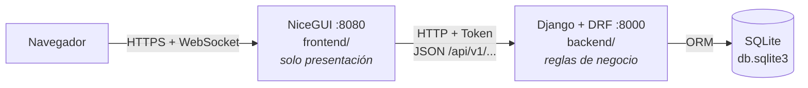
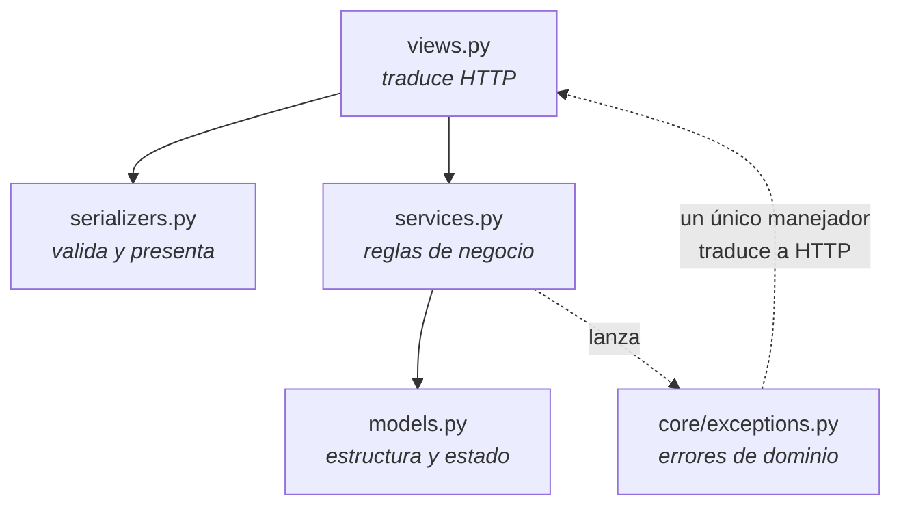
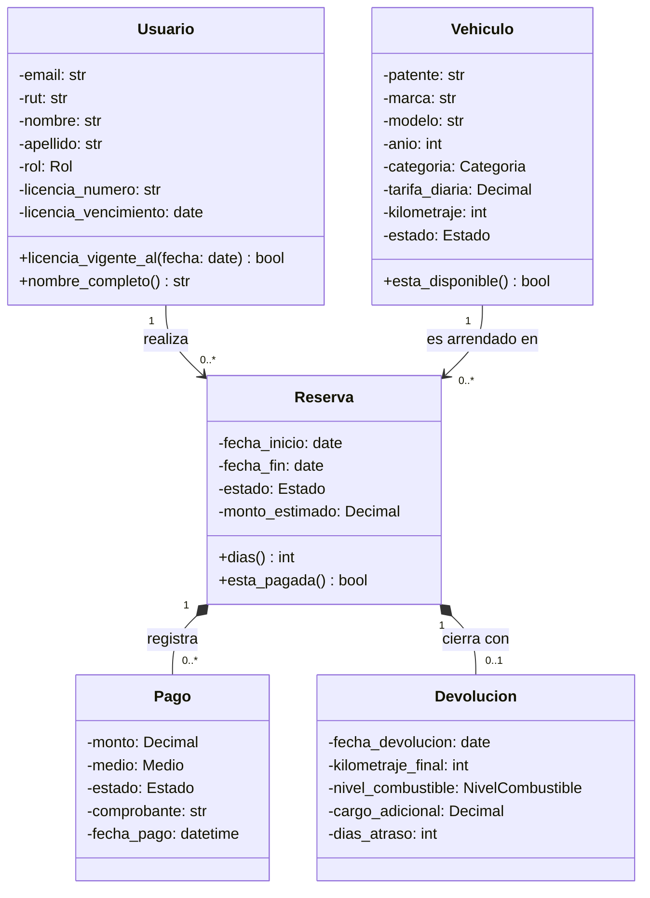
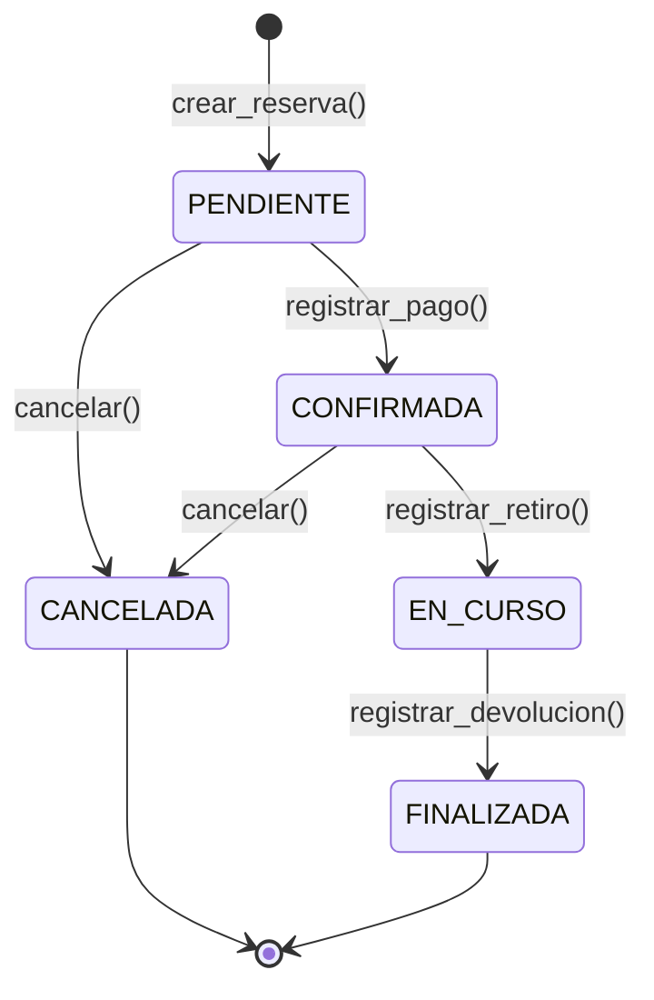
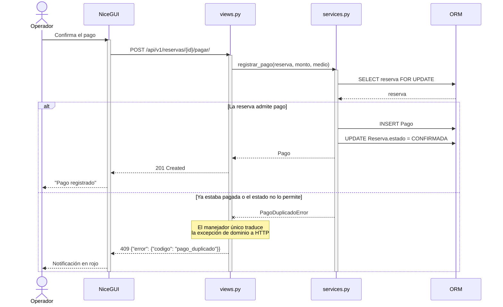
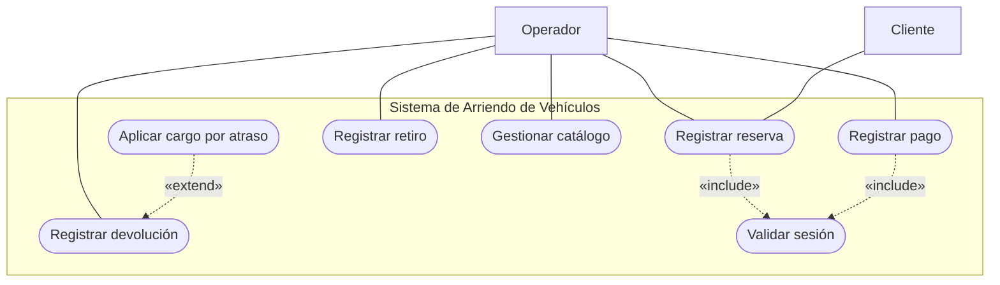
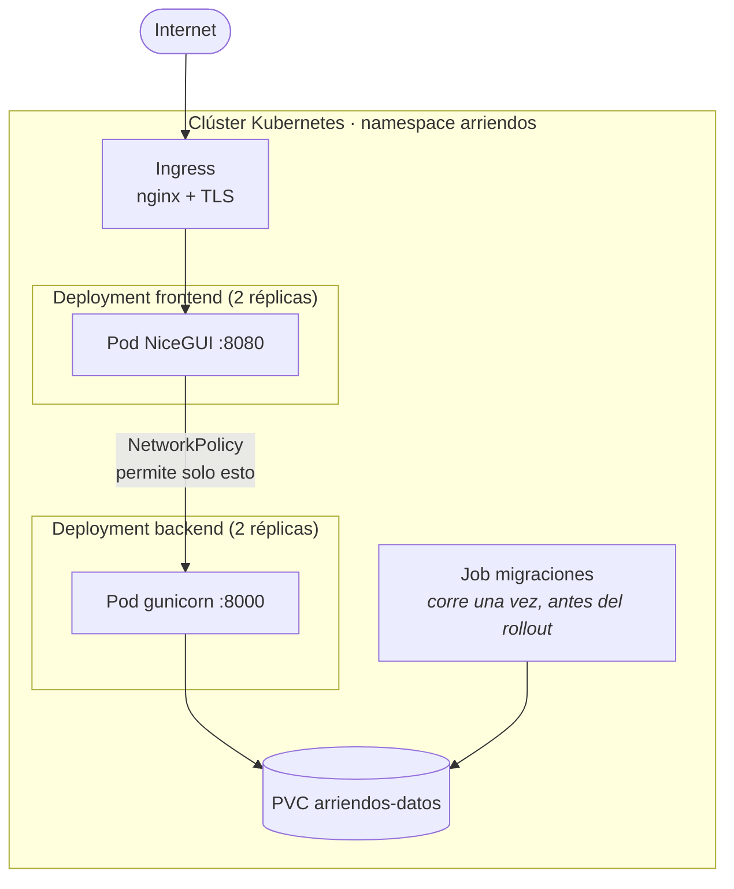

# Arquitectura y diseño — Sistema de Arriendo de Vehículos

Documento de diseño de la asignatura **Diseño de Software (IEI-050)**.
Los diagramas se escriben en Mermaid y no como imágenes exportadas: así viven
en el repositorio, entran en el *diff* de cada cambio y no se desincronizan en
silencio del código que describen.

---

## 1. Decisiones de proceso

| Decisión | Categoría | Justificación |
|---|---|---|
| **Iterativo-incremental** | Modelo de ciclo de vida | Los requisitos del enunciado se refinaron al ver el sistema funcionando. Cascada habría fijado el diseño antes de tener esa información. |
| **Scrum** | Marco de gestión | Implementa el modelo iterativo-incremental mediante sprints. No es un ciclo de vida en sí. |
| **Prototipado de interfaz** | Técnica de requisitos | Validar las pantallas antes de comprometer reglas de negocio. |

> La distinción importa: *modelo* es la estructura de alto nivel, *marco* es
> cómo se ejecuta ese modelo, *técnica* es una herramienta puntual dentro del
> proceso. Confundirlos es un error de categoría.

---

## 2. Vista de componentes

Dos procesos separados. La interfaz **nunca** toca el ORM: consume la API igual
que cualquier otro cliente. Eso mantiene las reglas de negocio en un solo lugar
y permite probarlas sin levantar un servidor.

### Capas del backend

Las vistas no arman respuestas de error a mano: los servicios **lanzan**
excepciones de dominio y un único manejador las traduce al contrato
`{"error": {"codigo", "mensaje", "detalle"}}`. El `codigo` es el identificador
estable que consume la interfaz; el `mensaje` en español puede cambiar sin
romper a nadie.

---

## 3. Diagrama de clases del dominio

**Lectura de las multiplicidades** (se leen cruzadas): *un* usuario realiza
*cero o muchas* reservas; *cada* reserva pertenece a *exactamente un* usuario.

**Por qué composición (◆) entre `Reserva` y sus partes:** un pago o una
devolución **no significan nada sin su reserva** — si la reserva desaparece,
la parte deja de tener sentido. Por eso `Pago` y `Devolucion` se borran en
cascada con ella. En cambio, `Usuario` y `Vehiculo` existen por su cuenta: su
relación con `Reserva` es una asociación simple, no una composición.

**Navegabilidad:** la flecha va de `Usuario`/`Vehiculo` hacia `Reserva` porque
es la reserva la que guarda las claves foráneas. Coincide con el código: en
Django, `Reserva.usuario` es el atributo real y `usuario.reservas` es el acceso
inverso que genera el ORM.

> Las cinco entidades se agrupan en **tres apps** (`usuarios`, `vehiculos`,
> `arriendos`) según su límite de agregado, no una app por modelo: `Reserva`,
> `Pago` y `Devolucion` forman un solo agregado con la reserva como raíz.

---

## 4. Máquina de estados de la reserva

Las transiciones no permitidas lanzan `TransicionNoPermitidaError`; no se
"corrigen" en silencio.

Estado del vehículo asociado: pasa a `ARRENDADO` en `registrar_retiro()` y
vuelve a `DISPONIBLE` (o a `MANTENIMIENTO`, si hubo daños) al registrar la
devolución.

---

## 5. Diagrama de secuencia — registrar un pago

Escenario con su camino de error explícito, en un fragmento `alt`, no como un
comentario al margen.

---

## 6. Casos de uso

**`«include»` vs `«extend»`** — se confunden casi siempre:

- **`«include»`**: el caso base **siempre** ejecuta el incluido. "Registrar
  reserva" siempre valida la sesión. La flecha va del **base al incluido**.
- **`«extend»`**: comportamiento **condicional**. "Aplicar cargo por atraso"
  solo ocurre si la devolución llega tarde. La flecha va del **extensión al
  base**, en sentido contrario.

Los actores son **roles**, no personas ni cargos, y quedan fuera del límite del
sistema.

---

## 7. Vista de despliegue

Decisiones y su motivo:

- **Solo la interfaz se expone.** La API queda en `ClusterIP` porque su único
  cliente es el frontend; publicarla ampliaría la superficie sin necesidad.
- **Migraciones en un `Job` aparte.** Con dos réplicas, ponerlas en el arranque
  del contenedor haría que ambos procesos migraran a la vez sobre la misma base.
- **Sesión pegajosa en el Ingress.** NiceGUI mantiene un WebSocket con estado
  en el pod: sin afinidad, la reconexión puede caer en otro pod y perder la sesión.

Detalle de los manifiestos en [`deploy/k8s/`](../deploy/k8s/) y de la
infraestructura previa en [`infra/`](../infra/).

---

## 8. Correspondencia diseño ↔ código

Un diagrama que no coincide con el código es documentación falsa. Esta tabla es
lo que hay que revisar al modificar el modelo:

| En UML | En el código |
|---|---|
| `Usuario "1" --> "0..*" Reserva` | `Reserva.usuario = ForeignKey(..., related_name="reservas")` |
| `Reserva "1" *-- "0..*" Pago` (composición) | `Pago.reserva = ForeignKey(Reserva, on_delete=CASCADE)` |
| `Reserva "1" *-- "0..1" Devolucion` | `Devolucion.reserva = OneToOneField(Reserva, on_delete=CASCADE)` |
| Multiplicidad `0..1` | `OneToOneField` — una reserva se devuelve una sola vez |
| Transición no permitida | `TransicionNoPermitidaError` en `services.py` |

**Al cambiar el modelo, auditar este documento en el mismo commit.** Un
diagrama obsoleto es peor que uno ausente: alguien lo va a creer.
